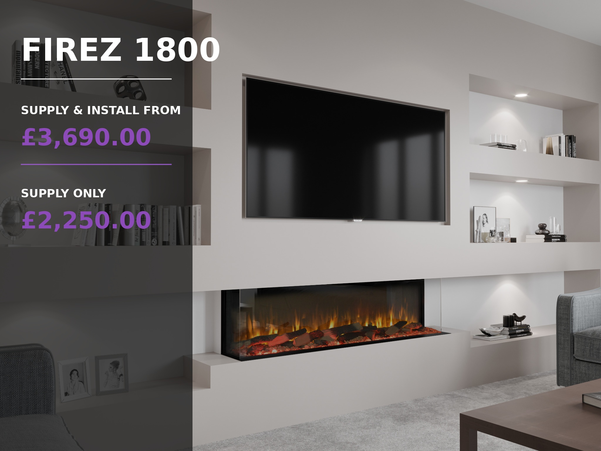

# FIREZ 1800 AR Glass Electric Fireplace

## Pricing

**Supply & Install From: £3,690.00**  
**Supply Only: £2,250.00**

## Short Description

Built for large media walls, the FIREZ 1800 delivers a spectacular widescreen flame display with smart controls, panoramic glass options and a striking luxury finish.

## Product Description

The FIREZ 1800 is designed to make a bold statement. With its impressive extra-wide flame display, it is the perfect choice for full-width media walls and larger living spaces, creating a truly luxurious centrepiece that instantly transforms any room.

Featuring one of the most realistic 3D Reflectory Flame effects available, the FIREZ 1800 delivers the ambience and visual appeal of a real wood-burning fire—without the mess, maintenance or inconvenience.

## Premium Features

- Ultra-realistic 3D Reflectory Flame technology
- Remote control included
- Smartphone app control
- Alexa voice control compatibility
- Manual push-button controls
- Multiple flame colour options
- Adjustable ember bed and overhead lighting colours
- Choice of 1, 2 or 3-sided panoramic glass installation
- High-definition interchangeable log fuel bed included
- Optional upgrade to a deluxe real log fuel bed

## Dimensions

- **Height:** 616.5mm
- **Width:** 1830mm
- **Depth:** 333mm

**Available from Zebra Trades with supply only or professional installation.**
