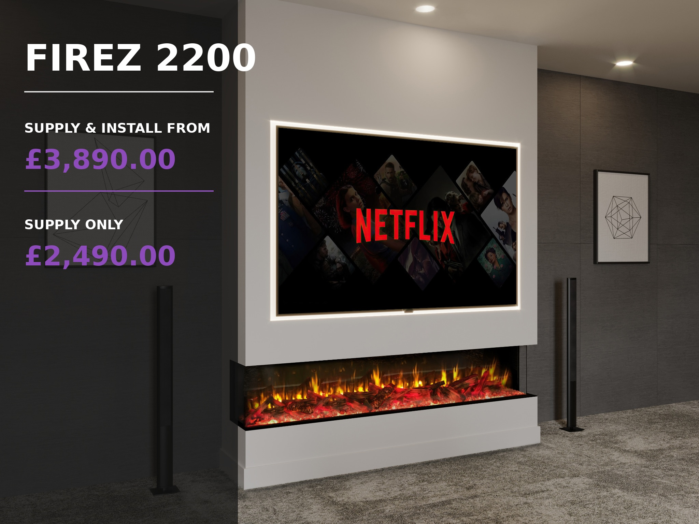

# FIREZ 2200 Electric Fireplace

## Pricing

**Supply & Install From: £3,890.00**  
**Supply Only: £2,490.00**

## Short Description

The flagship FIREZ 2200 delivers an extraordinary 2.2-metre panoramic flame display, premium smart controls and stunning visual impact for the largest luxury media walls.

## Product Description

The FIREZ 2200 is the flagship model in the range, delivering an extraordinary panoramic flame display that transforms even the largest living spaces. At over 2.2 metres wide, it is designed for luxury media walls where maximum visual impact and breathtaking realism are the priority.

Powered by FIREZ's advanced 3D Reflectory Flame technology, the 2200 creates one of the most realistic electric flame effects available, bringing the atmosphere of a real wood-burning fire into your home without the maintenance, smoke or mess.

## Premium Features

- Ultra-realistic 3D Reflectory Flame technology
- Remote control included
- Smartphone app control
- Alexa voice control compatibility
- Manual push-button controls
- Multiple flame colour options
- Adjustable ember bed and overhead lighting colours
- Choice of 1, 2 or 3-sided panoramic glass installation
- High-definition interchangeable log fuel bed included
- Optional upgrade to a deluxe real log fuel bed

Whether you're designing a luxury open-plan living area, a home cinema or a statement feature wall, the FIREZ 2200 offers unmatched scale and flexibility. Its extra-wide flame picture creates an incredible focal point, while adjustable flame colours, ember lighting and ambient illumination allow you to create the perfect atmosphere throughout the year, with or without the heat function.

## Dimensions

- **Height:** 616.5mm
- **Width:** 2233mm
- **Depth:** 333mm

**Available from Zebra Trades with supply only or professional installation.**
