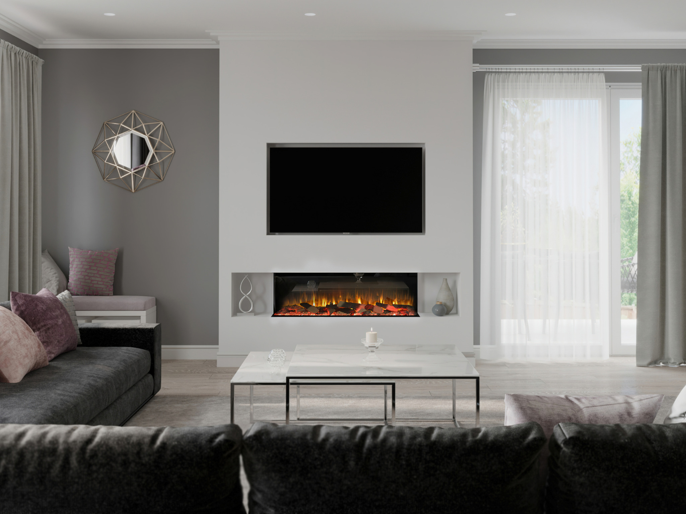

# Media Wall 1250

## Pricing

**Supply & Install From: £3,390.00**  
**Supply Only: £1,590.00**

## Product Description

The Media Wall 1250 is the perfect choice for homeowners looking to create a stunning media wall without overwhelming the room. Its sleek proportions make it ideal for smaller living spaces while still delivering an impressive centrepiece.

Featuring one of the most realistic 3D reflective flame effects available, the Media Wall 1250 creates the warmth and ambience of a real wood-burning fire—without the mess, maintenance or inconvenience.

## Premium Features

- Ultra-realistic 3D flame technology
- Remote control included
- Smartphone app control
- Alexa voice control compatibility
- Manual push-button controls
- Multiple flame colour options
- Adjustable ember bed and overhead lighting colours
- Choice of 1, 2 or 3-sided panoramic glass
- High-definition interchangeable log fuel bed included
- Optional upgrade to a deluxe real log fuel bed
- 2.0kW heater
- Full manufacturer warranty

Whether you're creating a contemporary feature wall or a cosy living room focal point, the Media Wall 1250 offers exceptional flexibility and style. Customise the flame colours and lighting to match your mood and enjoy a fireplace that's beautiful all year round—even without the heat.

## Dimensions

- **Height:** 616.5mm
- **Width:** 1280mm
- **Depth:** 333mm
- **Heat output:** 2.0kW

## Included Images

- Sales image
- Scene image 1
- Scene image 2
- Technical specification sheet

**Available from Zebra Trades with supply only or professional installation.**
